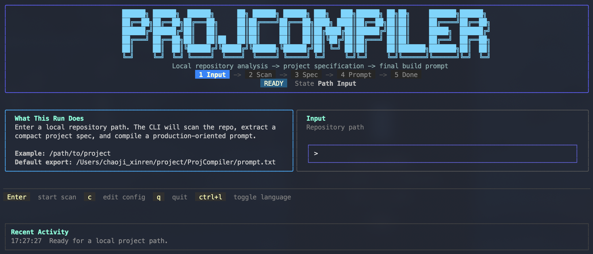
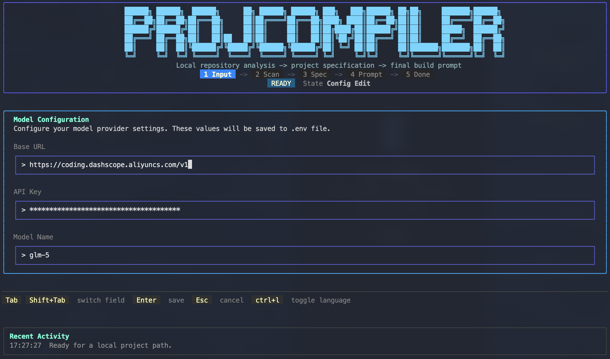

# ProjCompiler

[](https://go.dev/)
[](LICENSE)

[中文说明](README.zh-CN.md)

## What is ProjCompiler

> **"Code is a temporary artifact. Prompt is knowledge itself."**

A new trend is emerging on GitHub: open-source projects that provide only a Prompt, no code. Drop the Prompt into an AI, and it generates a complete, runnable application in one shot.

**ProjCompiler does the reverse**: it "reverse-engineers" your codebase into a precise Prompt.

```
Your Codebase ──→ ProjCompiler ──→ A Precise Project Prompt
                                       │
                                       ↓
                              Let AI Understand Your Project
```

### Why Do You Need It?

- **Migrate Projects to AI Development**: "Translate" existing codebases into spec documents AI can understand
- **Project Handoff Documentation**: Auto-generate structured project descriptions, more precise than manual docs
- **Knowledge Preservation**: When code degrades into instantiated output of Prompts, you need to "extract" the knowledge back
- **Multi-Model Compatible**: Generated Prompts aren't tied to any specific AI—any model can understand your project

> **When open source shifts from "show me the code" to "show me the Prompt", ProjCompiler helps you complete the paradigm shift from code to Prompt.**

---

## Core Features

- **Smart Repository Scanning** - Automatically identifies project structure, build manifests, docs, entrypoints, and representative code snippets
- **Spec Synthesis** - Derives compact project specs (goals, tech profile, modules, constraints) from raw facts
- **Prompt Compilation** - Applies `/init` pruning rules, keeping only information models might get wrong
- **Confidence Annotation** - Each fact carries a `FactSignal` (Observed/Inferred/Missing) for traceability
- **Interactive TUI** - Bubble Tea-based terminal interface with bilingual switch (Ctrl+L)
- **Graceful Degradation** - Falls back to deterministic synthesis when LLM is unavailable

## Architecture Overview

ProjCompiler uses a four-stage pipeline:

```
Scan → SpecBuilder → PromptCompiler → Exporter
```

| Data Structure | Source | Description |
|---------------|--------|-------------|
| `RepoFacts` | Scanner | Raw facts (file tree, docs, build info, entrypoints, snippets) |
| `ProjectSpec` | SpecBuilder | Compact spec (goals, tech profile, modules, constraints) |
| `PromptBundle` | PromptCompiler | Compiled prompt text |

Project layout:

```
cmd/projcompiler/     # Entry point
internal/
  app/                # App wiring, contracts
  config/             # Config loading
  scan/               # Repository scanning (orchestrator + 5 probe tools)
  spec/               # Shared data structures
  prompt/             # Prompt compilation
  adkflow/            # LLM spec synthesis
  tui/                # Bubble Tea terminal UI
```

## Screenshots

### TUI Interface



### Configuration



## Quick Start

### Build

```bash
go build -o projcompiler ./cmd/projcompiler
```

### Configure

Configuration can be set via `.env` file or directly in the TUI configuration page.

Copy `.env.example` to `.env`:

```bash
cp .env.example .env
```

Configuration options:

| Key | Description | Required |
|-----|-------------|----------|
| `PROJCOMPILER_BASEURL` | Model endpoint | Yes |
| `PROJCOMPILER_APIKEY` | API key | Yes |
| `PROJCOMPILER_MODEL` | Model name | Yes |
| `PROJCOMPILER_OUTPUT_LANGUAGE` | Output language | No |

### Run

```bash
./projcompiler
```

Enter a project path after launch. The app runs scan → spec synthesis → prompt compilation, then exports `prompt.txt`.

## Usage Examples

### Pack your project through a prompt

```bash
./projcompiler
> Enter path: /path/to/your/project
> Output: prompt.txt
```

Submit the generated `prompt.txt` to an AI model for implementation suggestions tailored to your project context.

## Contributing

Issues and Pull Requests are welcome.

1. Fork this repository
2. Create a feature branch (`git checkout -b feature/amazing-feature`)
3. Commit your changes (`git commit -m 'Add amazing feature'`)
4. Push to the branch (`git push origin feature/amazing-feature`)
5. Create a Pull Request

## License

[GPL-3.0](LICENSE)