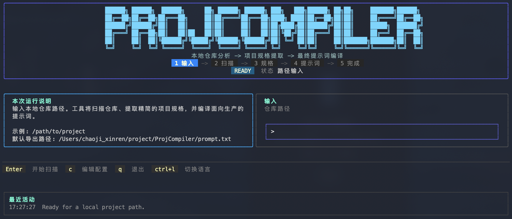
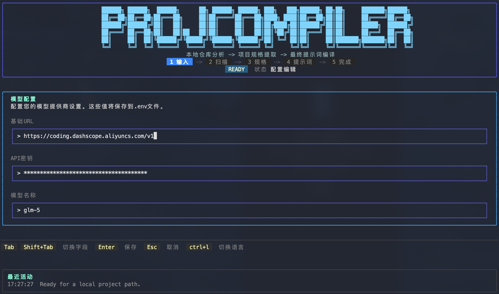

# ProjCompiler

[](https://go.dev/)
[](LICENSE)

[English README](README.md)

## 什么是 ProjCompiler

> **"代码是临时产物，Prompt 才是知识本身。"**

GitHub 上出现了一种新趋势：开源项目只提供 Prompt，没有代码。把 Prompt 丢给 AI，一键生成完整可运行的应用。

**ProjCompiler 做的是相反的事**：把你的代码仓库"逆向工程"成精确的 Prompt。

```
你的代码仓库 ──→ ProjCompiler ──→ 一份精确的项目 Prompt
                                    │
                                    ↓
                              让 AI 理解你的项目
```

### 为什么你需要它？

- **迁移项目给 AI 开发**：把现有代码库"翻译"成 AI 能理解的规格说明书
- **项目交接文档**：自动生成结构化的项目描述，比手工写文档更精准
- **知识沉淀**：当代码退化为 Prompt 的实例化输出，你需要把知识"提取"回来
- **多模型兼容**：生成的 Prompt 不绑定特定 AI，任何模型都能理解你的项目

> **当开源从"秀代码"变成"秀 Prompt"，ProjCompiler 帮你完成从代码到 Prompt 的范式转换。**

---

## 核心特性

- **仓库智能扫描** - 自动识别项目结构、构建清单、文档、入口点和代表性代码片段
- **规格合成** - 从原始事实推导紧凑的项目规格（目标、技术画像、模块、约束）
- **提示词编译** - 采用 `/init` 剪枝规则，只保留模型可能出错的关键信息
- **置信度标注** - 每个事实携带 `FactSignal`（Observed/Inferred/Missing），确保可追溯性
- **交互式 TUI** - 基于 Bubble Tea 的终端界面，支持中英文切换（Ctrl+L）
- **优雅降级** - LLM 不可用时自动回退到确定性合成

## 架构概览

ProjCompiler 采用四阶段流水线：

```
Scan → SpecBuilder → PromptCompiler → Exporter
```

| 数据结构 | 来源 | 说明 |
|---------|------|------|
| `RepoFacts` | Scanner | 原始事实（文件树、文档、构建信息、入口点、代码片段） |
| `ProjectSpec` | SpecBuilder | 紧凑规格（目标、技术画像、模块、约束） |
| `PromptBundle` | PromptCompiler | 编译后的提示词文本 |

项目结构：

```
cmd/projcompiler/     # 入口点
internal/
  app/                # 应用装配、服务契约
  config/             # 配置加载
  scan/               # 仓库扫描（编排器 + 5 个探测工具）
  spec/               # 共享数据结构
  prompt/             # 提示词编译
  adkflow/            # LLM 规格合成
  tui/                # Bubble Tea 终端 UI
```

## 界面截图

### TUI 界面



### 配置界面



## 快速开始

### 构建

```bash
go build -o projcompiler ./cmd/projcompiler
```

### 配置

配置项可通过 `.env` 文件或直接在 TUI 配置页面中设置。

复制 `.env.example` 到 `.env`：

```bash
cp .env.example .env
```

配置选项：

| 键名 | 说明 | 必需 |
|-----|------|-----|
| `PROJCOMPILER_BASEURL` | 模型端点 | 是 |
| `PROJCOMPILER_APIKEY` | API 密钥 | 是 |
| `PROJCOMPILER_MODEL` | 模型名称 | 是 |
| `PROJCOMPILER_OUTPUT_LANGUAGE` | 输出语言 | 否 |

### 运行

```bash
./projcompiler
```

启动后输入项目路径，程序依次执行扫描 → 规格合成 → 提示词编译，最终导出 `prompt.txt`。

## 使用场景示例

### 打包你的项目通过提示词

```bash
./projcompiler
> 输入路径: /path/to/your/project
> 输出: prompt.txt
```


## 参与贡献

欢迎提交 Issue 和 Pull Request。

1. Fork 本仓库
2. 创建特性分支 (`git checkout -b feature/amazing-feature`)
3. 提交更改 (`git commit -m 'Add amazing feature'`)
4. 推送分支 (`git push origin feature/amazing-feature`)
5. 创建 Pull Request

## 许可证

[GPL-3.0](LICENSE)