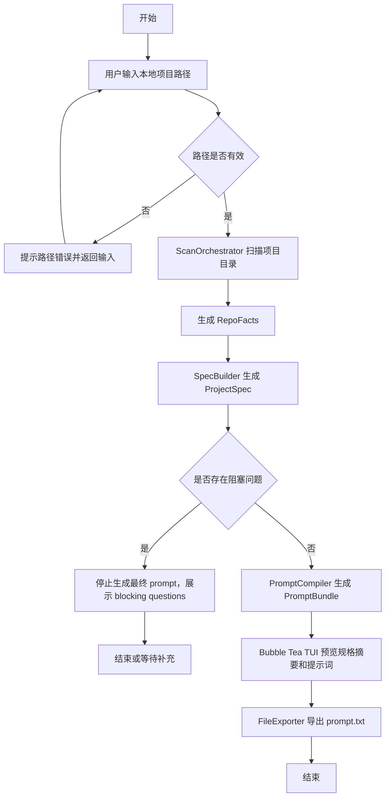
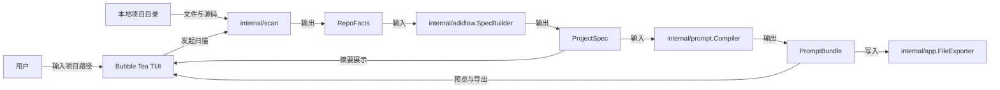
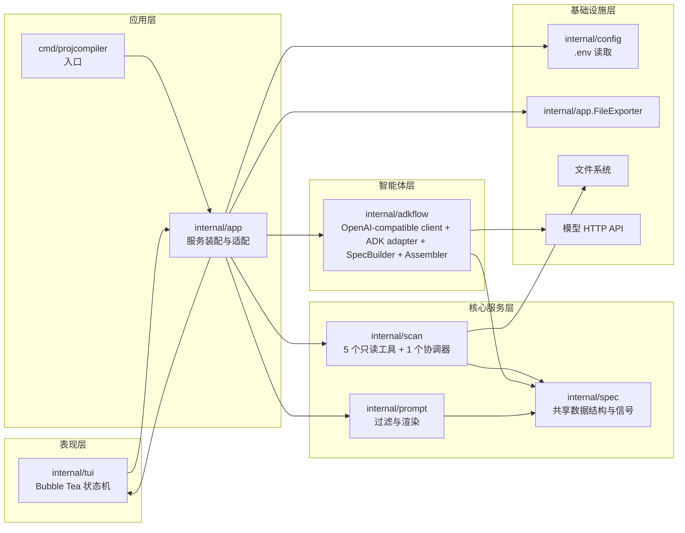

# 最小可行性应用架构图

本文档描述 `ProjCompiler` 当前 MVP 的目标架构，并标注本轮代码已经落地到哪些包、哪些地方仍处于待验证状态。

## 架构说明

- 表现层负责接收项目路径、展示阶段状态、预览提示词并导出结果。
- 应用层负责装配扫描、规格构建、提示词编译与导出流程。
- 核心服务层分成扫描、规格、prompt 三块，尽量保持边界清晰。
- 智能体层使用 `google.golang.org/adk`，当前采用固定顺序工作流思路。
- 基础设施层负责 `.env` 配置读取、文件系统访问、HTTP 模型请求和导出文件。

## 首版输出约束

- 首版最终输出物只是一段英文纯提示词文本。
- 首版不生成任何特定工具的命令包装。
- 首版不绑定 `claude`、`codex` 或其他命令行工具格式。
- 首版不导出 `spec.json`，只导出提示词文本。

## 首版模型配置约束

- 模型配置通过 `.env` 文件提供。
- 当前实现读取 `baseurl`、`apikey`、`model` 这三类核心配置。
- 接入方式是 OpenAI-compatible HTTP API。
- 首版按“单次选择一个 provider”工作，不做多模型自动切换。

## 最小流程图

## 最小数据流图

## 架构图

## 当前实现映射

已经落地到代码的模块：

- `internal/scan`
  - 已实现 `RepoTreeTool`
  - 已实现 `ManifestProbeTool`
  - 已实现 `DocsProbeTool`
  - 已实现 `EntrypointProbeTool`
  - 已实现 `SnippetSelectTool`
  - 已实现 `ScanOrchestrator`
- `internal/spec`
  - 已实现 `RepoFacts`
  - 已实现 `ProjectSpec`
  - 已实现 `PromptBundle`
  - 已实现 `FactSignal`
- `internal/adkflow`
  - 已实现 OpenAI-compatible client
  - 已实现 ADK `model.LLM` 适配层
  - 已实现 `SpecBuilder`
  - 已实现 `Assembler`
- `internal/prompt`
  - 已实现 prompt-worthiness filter
  - 已实现 prompt 渲染
- `internal/tui`
  - 已实现 `PathInput -> Scanning -> SpecSummary -> PromptPreview -> Done`
- `internal/app` 与 `cmd/projcompiler`
  - 已开始 wiring
  - 当前 `main.go` 已注入 `SpecBuilder`、`PromptCompiler`、`AgentAssembler`
  - `Scanner` 和 `Exporter` 通过默认装配接入

## 当前仍未完成或待验证

- ADK 流程虽然已落代码，但还没有在当前仓库里完成一次正式的端到端验证
- `go test ./...` 当前仍未通过
  - 当前可见原因是 `go.sum` 缺少部分传递依赖校验项
  - 当前环境的默认 Go cache 路径也有权限限制
- 当前尚未补充稳定的集成测试或端到端测试
